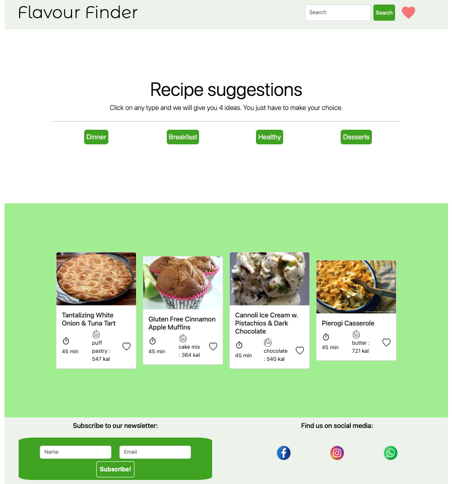
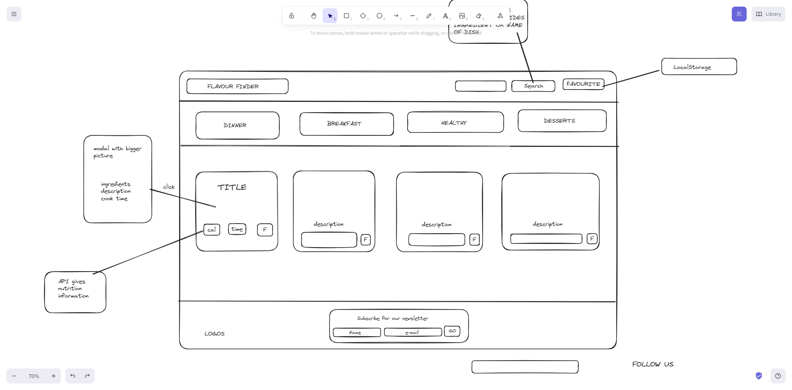

# flavour-finder
Creating an API that solves a real-world problem

## Description

This is the first group project from the edX Bootcamp. We need to build a web application from scratch. With our team, we'll conceive and execute a design that solves a real-world problem by integrating data received from multiple server-side API requests.

Working collaboratively, we'll learn agile development methodologies and implement feature and bug fixes using Git branch workflow and pull requests.

We'll write your own user stories and acceptance criteria in GitHub Issues to help your team stay on track with the project. Using GitHub Project to track the status of your project tasks will help you understand the benefits of Kanban boards.

## Acceptance Criteria

The project must fulfill the following requirements:

- Use Bootstrap.
- Be deployed to GitHub Pages.
- Be interactive (in other words, accept and respond to user input).
- Use at least two server-side APIsLinks to an external site..
- Use modals instead of alerts, confirms, or prompts.
- Use client-side storage to store persistent data.
- Be responsive.
- Have a polished UI.

Have a clean repository that meets quality coding standards (file structure, naming conventions, best practices for class/id naming conventions, indentation, quality comments, and so on).

Have a quality README (including a unique name, description, technologies used, screenshot, and link to the deployed application).

## User Story

As an 'hungry' user I want to check some recipes ideas for me and my family, I might come back to visit this website to I want to save recipes for future. Also I'm in a diet so I need to be careful with the calories. Sometimes I'm a bit undecided about which type of food I want, so I fancy some suggestions from different type of cuisines.
Open site
See navbar with search input and favourite button - I can search for different ingredients, cuisines or recipe names.
See header with 4 different cards with different suggestions - Dinner, Breakfast, Healthy, Desserts.
See main container with 4 cards with random suggestions, after I click search, I will have the recipe I searched for and 3 others similar recipes; or, if i searched for ingredients, i will have 4 recipes that use that ingredient.
The cards show me the calouris, cooking time and a Favourite button.
Click the cards to open a modal with a bigger picture, where i can check the ingredients, how to cook it and the cooking time.
See the footer with some social media logos and a "subscribe for our newsletter" card.

## Table of Contents
- [Installation](#installation)
- [Usage](#usage)
- [Credits](#credits)

## Installation
N/A

## Usage
To use the application here you have the link to the deployed webpage: https://blaztted.github.io/flavour-finder/

Once you open the application ther are four random recipes being displayed in four cards. You can also click on the buttons from the recipe suggestions (Dinner, Breakfast, Healthy and Dessert) and then 4 different recipe for each 
and Write a task in the middle section and click on the button with the disk.

There is also a favorite button ❤️ where the user can save the favourite recipes that will be stored in `localStorage`.

If you refresh the page, your favouirte recipes should be at the local storage.

Here you have a screenshot from the web page:

And here you have the previous wireframe:

- Technologies used:
HTML
CSS
JavaScript
Bootstrap
Jquery

## Credits

Thanks to the instructor Laura Cole and to the TA Martin William from EDX for all their knowledge and support.
Also thank you for all the team members, it has been a pleasure to work together sharing ideas and the code.

Sources:

https://api.jquery.com/

https://developer.mozilla.org/en-US/docs/Web/API/Window/localStorage

https://getbootstrap.com/docs/5.0/components/modal/

www.flaticon.com (icons)

## Badges

*JavaScript 56.2%

*HTML 34.1%

*CSS 9.7%

*BOOTSTRAP

*JQUERY

